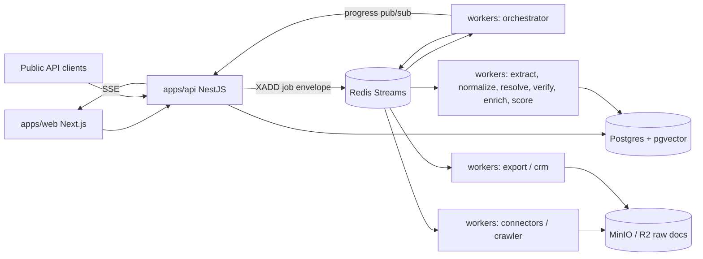

# 01 — Architecture

## Shape
Modular monolith API + Python worker pools on a shared job contract. The API never crawls or calls LLMs for research; it validates, authorizes, reserves credits, creates job rows, and publishes jobs.



## Components
| Component | Owns | Does not |
| --- | --- | --- |
| apps/web | UI, client state, SSE subscription | Business rules, direct DB access |
| apps/api | Auth, tenants, RBAC, CRUD, spec parse endpoint proxy, job creation, credits ledger, billing webhooks, public API, SSE relay, DB migrations | Crawling, extraction, long-running work |
| workers/orchestrator | Plans research DAG, dispatches tasks, critic loop, budgets | Fetching pages directly |
| workers/connectors | Official API calls (Places, SERP, registries, ATS) | Storing without provenance |
| workers/crawler | Frontier, robots, rate limits, HTTP + browser fetch, raw storage | Any evasion of protections |
| workers/pipeline | Extract, normalize, resolve entities, verify, enrich, score, signals | Tenant billing decisions |
| workers/export, crm | Streaming exports, Sheets, CRM pushes | - |
| workers/ai | AI gateway (routing, schema enforcement, caching, metering) | Being bypassed by other modules |

## Job contract (details: `docs/adr/0001-stack-and-job-contract.md`)
- Streams: `jobs:research`, `jobs:discovery`, `jobs:crawl_http`, `jobs:crawl_browser`, `jobs:pipeline`, `jobs:llm`, `jobs:export`, `jobs:integration`, `jobs:schedule`. Dead letters: `dlq:<stream>`.
- Consumer groups per worker pool. Max attempts 5, exponential backoff with jitter using a delayed ZSET `jobs:delayed`.
- Envelope (JSON Schema in `packages/contracts/job-envelope.schema.json`):
```json
{ "job_id": "uuidv7", "type": "crawl.fetch", "org_id": "uuid|null", "research_job_id": "uuid|null",
  "idempotency_key": "string", "attempt": 1, "priority": "interactive|scheduled|backfill",
  "budget": {"credits_remaining": 120, "cost_cap_usd": 0.5}, "trace_id": "string",
  "payload": {}, "created_at": "iso8601" }
```
- Progress events on Redis pub/sub `progress:{research_job_id}`: `{stage, counts, credits_used, message, ts}`. API relays as SSE; final state is always persisted in Postgres.

## Research flow
Input -> Spec parse -> Plan -> Source selection -> Discovery -> Crawl -> Extract -> Normalize -> Resolve -> Verify -> Critic loop -> Enrich -> AI analysis -> Score -> Leads materialized -> Index -> Export. Stage details: `06-DATA-PIPELINE.md`.

## Multi-tenancy
- Organization -> Workspaces -> Memberships (role).
- Global tables (no RLS, workers write): companies, company_locations, company_domains, people, contacts, social_profiles, websites, field_values, raw_documents, signals, sources, industries, technologies.
- Tenant tables (RLS on `org_id`): searches, research_jobs, research_tasks, leads, lists, notes, tags, scoring_models, saved_searches, exports, integrations, api_keys, usage_events, credit_ledger, audit_logs.
- API sets `SET LOCAL app.org_id = '<uuid>'` inside each request transaction. Workers use a separate DB role; tenant writes by workers set the same context from the envelope.

## Error taxonomy
`transient` (retry) · `rate_limited` (delay per Retry-After) · `access_restricted` (stop, no retry) · `parse_failed` (flag connector, no retry) · `invalid_input` (fail fast) · `budget_exhausted` (pause job, ask user).

## Observability
OpenTelemetry in API and workers; JSON logs with `trace_id, org_id, job_id, source, cost_units`; Sentry; Prometheus metrics listed in `13-TESTING-QA.md` (monitoring section).

## Scaling triggers (do not build early)
| Trigger | Move |
| --- | --- |
| > 20 workers or > 1M pages/day | Kubernetes + KEDA autoscaling on stream lag |
| > 10 workflow steps with frequent crash recovery issues | Temporal |
| Search p95 > 300 ms or > 5M companies | Typesense/OpenSearch via outbox CDC |
| Postgres > 500 GB | Monthly partitions (already planned), replicas, then Citus |
| LLM spend > 30% of revenue | Self-hosted extraction model on vLLM |
